  

 

  <strong>Building production-oriented software systems that combine robust backends, machine learning, and intuitive interfaces.</strong>

  
  &nbsp;
  
  &nbsp;
  

---

### 🛠️ Tech Stack

| Domain | Core Technologies |
| :--- | :--- |
| **Backend** |    |
| **Frontend** |    |
| **ML / Data** |    |
| **Systems** |    |

---

### 🚀 Featured Systems

| 🛡️ **ChargeShield** | ⚽ **PL ValuEdge** |
| :--- | :--- |
| **AI Chargeback Defense & Decision Platform**  Explainable ML and human-in-the-loop chargeback decision platform with automated representment evidence generation.  `FastAPI` `React` `LightGBM` `SHAP`   | **Quantitative Football Valuation Terminal**  Production ML terminal for quantitative player valuation with out-of-time temporal backtesting.  `XGBoost` `FastAPI` `React`   &nbsp;  |
| 🏥 **CAREFlow India** | 🌦️ **ZoneZero** |
| **Healthcare Analytics & Forecasting**  Healthcare facility analytics and HMIS demand forecasting platform for public health resource planning.  `FastAPI` `React` `PostgreSQL` `Docker`   | **Disaster Readiness Platform**  Collaborative disaster-readiness and meteorological intelligence platform with real-time alerting.  `Java` `Spring Boot` `OpenWeather`   *(Collaborative)* |

---

## ⚡ Currently Exploring

`ML Systems` · `Decision Intelligence` · `Full-Stack Architecture`

---

### 📊 GitHub Activity

  
  &nbsp;
  

---

  <em>“Building systems, not just projects.”</em> 
  <strong>Ganeshan</strong> · <a href="https://github.com/GANESHANCS">github.com/GANESHANCS</a> · Chennai, India

